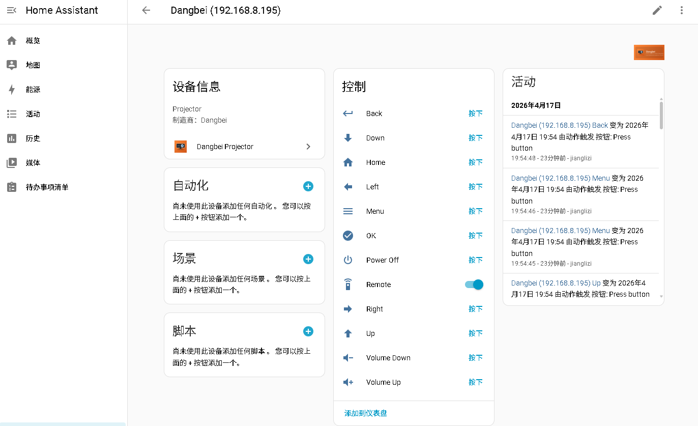

# ha-dangbei

Home Assistant 自定义集成，通过局域网 WebSocket 直连当贝投影仪，在 HA 中提供可视化遥控按钮、`remote` 电源实体，以及可选的 ESP32 BLE 开机能力。

仓库地址：<https://github.com/jianglizi/ha-dangbei>

## 功能

集成会创建一个 `Dangbei Projector` 设备，包含：

- 10 个 `button` 实体：`up`、`down`、`left`、`right`、`ok`、`back`、`home`、`menu`、`volume_up`、`volume_down`
- 1 个 `remote` 实体：名称显示为 `Power`，支持 `remote.send_command`、`remote.turn_on`、`remote.turn_off`
- 1 个 `binary_sensor` 实体：`online`，用于反映投影仪 WebSocket 是否在线

如果额外配置了配套的 ESP32 开机器 [`esp32-dangbei-wol`](./esp32-dangbei-wol)，还会新增：

- 1 个独立 ESP32 设备
- 1 个 `binary_sensor.esp32_online`，用于反映 ESP32 HTTP API 是否在线
- `remote.turn_on` 会通过 ESP32 触发 BLE 广播唤醒投影仪

发送 `power_off` 后，集成会按默认 2 秒延迟自动补发一次 `ok`，用于关闭关机确认弹窗。这个行为可在选项中关闭或调整延迟。

点击 `Power` 开关后，集成会先进入一个快速确认窗口，再回落到基线慢轮询：

- 基线轮询默认 10 秒
- 开机后会立即刷新，并以 1 秒频率确认最多 30 秒
- 关机后会立即刷新，并以 1 秒频率确认最多 45 秒
- 确认窗口内 `Power` 会锁定目标状态，避免 UI 先反弹再收敛

## 示例

<p align="center">
  
</p>

<p align="center"><em>Home Assistant 中的 Dangbei Projector 实体示例</em></p>

## 安装

### HACS

1. 打开 HACS。
2. 进入 `Integrations`。
3. 添加自定义仓库 `https://github.com/jianglizi/ha-dangbei`，类别选择 `Integration`。
4. 搜索 `Dangbei Projector` 并安装。
5. 重启 Home Assistant。

### 手动安装

把仓库中的 [`custom_components/dangbei`](./custom_components/dangbei) 整个目录复制到 Home Assistant 的 `config/custom_components/` 下：

```text
config/custom_components/
└── dangbei/
    ├── __init__.py
    ├── binary_sensor.py
    ├── brand/
    ├── button.py
    ├── client.py
    ├── coordinators.py
    ├── config_flow.py
    ├── const.py
    ├── device_info.py
    ├── manifest.json
    ├── remote.py
    ├── wake_profiles.py
    └── translations/
```

然后重启 Home Assistant。

## 配置

在 Home Assistant 中依次进入：

`设置 -> 设备与服务 -> 添加集成 -> Dangbei Projector`

主要配置项：

| 字段 | 说明 |
| --- | --- |
| Host / IP | 投影仪局域网 IP，例如 `192.168.8.195` |
| Port | WebSocket 端口，默认 `6689` |
| Device ID | 抓包中 `data.toDeviceId` 的值 |
| toId / fromId / Message type | 协议字段，大多数情况下可直接使用默认值 |
| Auto-confirm power-off dialog | 发送关机命令后是否自动补发一次 `ok` |
| Power-off confirm delay | 自动确认延迟，默认 2 秒 |
| ESP32 WOL host / port / token | 可选；填写后启用 ESP32 远程开机 |
| ESP32 wake profile | `D5X Pro`、`F3 Air` 或 `Custom` |
| Custom wake format | 自定义时可选 `Manufacturer data only` 或 `Full advertising data` |
| Custom wake hex | 自定义开机包 Hex，允许空格和换行 |

选项页还提供：

- Online status poll interval：投影仪和 ESP32 状态的基线轮询周期，默认 10 秒，可调 5 到 60 秒
- 与配置流相同的 ESP32 wake profile / custom format / custom hex

说明：

- 若配置了 ESP32，保存配置时会立即把开机包配置同步到 ESP32 并持久化到 NVS。
- 旧版 `esp32-dangbei-wol` 固件没有 `/api/wakeup_config`，此时保存会失败并提示先升级固件。
- `Custom + Manufacturer data only` 期望填写完整 Manufacturer Data 负载（包含公司 ID，例如 `46 00 ...`）。
- `Custom + Full advertising data` 期望填写完整 AD payload，最大 31 字节。

注意：

- 投影仪的 WebSocket 地址和 `device_id` 仍需手动填写。
- 即使 Home Assistant 通过 zeroconf 自动发现了 ESP32，也只是帮你预填 WOL 地址，不会自动补出投影仪的协议参数。

## 使用

### Lovelace 按钮

每个方向 / 菜单 / 音量键都会暴露为独立的 `button.*` 实体，可以直接加到卡片中。

### 自动化发送按键

```yaml
service: remote.send_command
target:
  entity_id: remote.<your_projector_remote>
data:
  command:
    - home
    - down
    - ok
  delay_secs: 0.3
```

也支持直接传入单个命令字符串：

```yaml
service: remote.send_command
target:
  entity_id: remote.<your_projector_remote>
data:
  command: home
```

### 关机

```yaml
service: remote.turn_off
target:
  entity_id: remote.<your_projector_remote>
```

### 开机（需 ESP32 WOL）

```yaml
service: remote.turn_on
target:
  entity_id: remote.<your_projector_remote>
```

## 说明

### 开机限制

投影仪关机后 WebSocket 不在线，因此仅靠本集成本身无法通过网络开机。

如果需要远程开机，推荐配套使用 [`esp32-dangbei-wol`](./esp32-dangbei-wol)：

- ESP32-C3 固件会在局域网内提供 HTTP REST API，并在收到 `POST /api/wakeup` 时广播当前已配置的开机包
- Home Assistant 集成通过 `remote.turn_on` 调用它
- ESP32 会通过 mDNS 发布 `_dangbei-wol._tcp.local.`，HA 可自动发现并预填 WOL 地址
- HA 保存配置时会调用 `POST /api/wakeup_config`，把 `D5X Pro`、`F3 Air` 或自定义开机包同步到 ESP32

固件烧录、配网和 API 说明见 [`esp32-dangbei-wol/README.md`](./esp32-dangbei-wol/README.md)。

### 抓包替换协议字段

如果默认 `toId` / `fromId` 无法控制设备，可以抓取官方 App 的 WebSocket 数据：

1. 用抓包工具监听投影仪 `6689` 端口流量。
2. 使用当贝官方遥控 App 连接投影仪并按任意按键。
3. 找到 `data.command.command == "Operation"` 的消息。
4. 记录其中的 `fromId`、`toId` 和 `data.toDeviceId`。
5. 把这些值填回集成配置。

建议抓包后退出官方 App，避免多个客户端同时占用同一会话身份。

### 协议示例

```json
{
  "sn": "",
  "data": {
    "command": {
      "value": "<1~11>",
      "params": "",
      "command": "Operation",
      "from": 901
    },
    "toDeviceId": "<configured device id>"
  },
  "toId": "<configured>",
  "fromId": "<configured>",
  "type": "HB7FxtN64oc="
}
```

## 开发与贡献

- 问题反馈：请通过 GitHub Issues 提交
- 贡献说明：见 [CONTRIBUTING.md](./CONTRIBUTING.md)
- 基础校验：仓库内置 `hassfest`、HACS 校验和轻量静态检查 workflow
- 本地 HA 语法检查：`python3 -m compileall custom_components/dangbei`
- 本地 ESP32 固件构建：`source /opt/esp/v5.5/esp-idf/export.sh && cd esp32-dangbei-wol && idf.py build`

## 已测试机型

- 当贝 D5X Pro（`DBD5XPRO`）

其它当贝机型理论上也可尝试，欢迎提交兼容性反馈。

## 许可证

MIT © 2026 jianglizi
